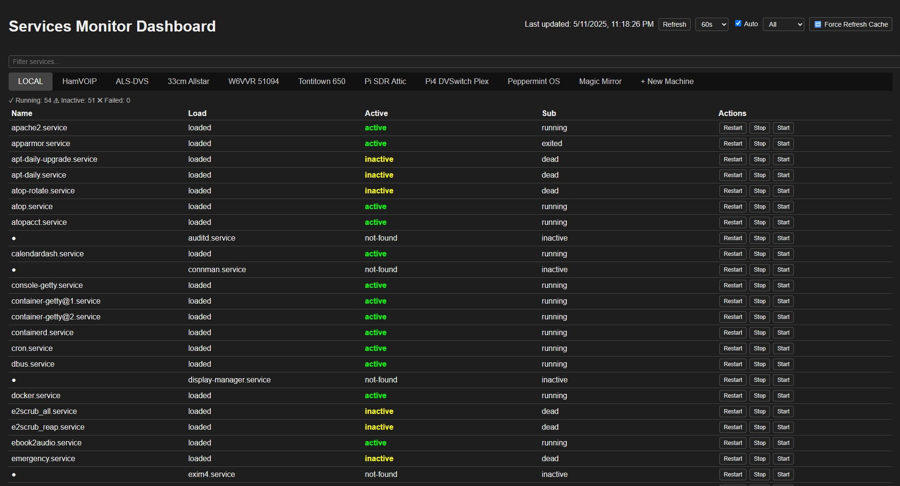
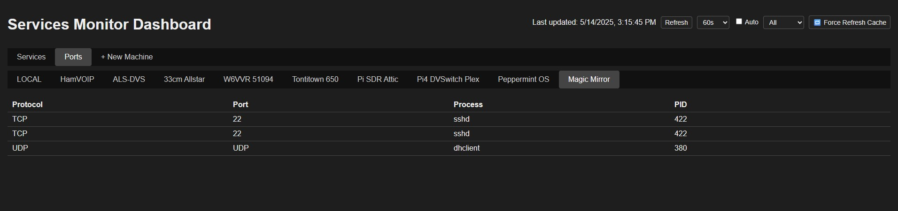

# 🖥️ Services Monitor Dashboard

A self-hosted web dashboard to monitor and control `systemd` services across multiple Linux hosts using SSH.

---

## ✨ Features

- 🔍 View, filter, and sort `systemctl` services
- 🟢 Restart / Stop / Start any service with one click
- 🔁 Auto-refresh with update timestamp
- ➕ Add new machines directly from the web interface
- ✅ SSH key-based login generation from the browser
- 📱 Mobile-friendly UI

---

## 🧠 How It Works

- The dashboard **always includes a built-in `LOCAL` tab** for the host it's running on.
- External systems are defined in `nodes.json`.
- If `nodes.json` is empty or missing, the dashboard still works with `LOCAL` only.
- The **`+ New Machine` tab** allows adding other systems by IP, username, port, and password.
    - It will generate an SSH key and copy it using the provided password (if needed).
    - Your `nodes.json` file is updated automatically.

---

## 🚀 New Features (May 2025)

### ✅ Unified Dashboard with Tabs

Top-level tabs for:

- **Services**
- **Ports**
- **+ New Machine**

### 🛠️ Auto-Refresh Controls

- Auto-refresh is **enabled by default on first load** (for services only)
- Automatically **disables after 5 seconds**
- User-selectable refresh interval: `60s`, `120s`, or `300s`
- Manual **Refresh** and **Force Refresh Cache** buttons available

### 🔁 Manual Port Fetching

- **Ports tab does not auto-refresh** (by design)
- Port data is fetched only when:
  - You switch to the Ports tab for the first time
  - You click the **Refresh** button while on the Ports tab

### 🔍 Service & Port Filtering

- **Services tab** filters by:
  - `All`, `Active`, `Inactive`, `Failed`
- **Ports tab** filters by:
  - `All`, `TCP`, `UDP`

### 📋 Logs Viewer with Live Mode

- View `systemd` logs per service
- Enable **Live Logs** (polls every 2s using `-n 10`)
- Download logs as `.log` files
- Closing the modal **automatically stops** live log polling

### ➕ Add New Machines Easily

- Use the **+ New Machine** tab to add nodes
- Supports:
  - IP, Port, Username, optional password
- Automatically generates and deploys SSH keys
- Persists new nodes in `nodes.json`


## ⚙️ Installation

### Option 1: Install with Script

```bash
curl -s https://raw.githubusercontent.com/mjwgeek/Services-Monitor-Dashboard/main/install.sh | bash
```
### Option 2: Clone and run manually

```bash
git clone https://github.com/mjwgeek/Services-Monitor-Dashboard.git
cd servicemonitor
chmod +x install.sh
./install.sh
```

👉 Visit your dashboard at `http://YourIpAddress:8484`

## 🔄 Updating the Dashboard

To update your existing Service Monitor Dashboard to the latest version:

```bash
curl -s -o update.sh https://raw.githubusercontent.com/mjwgeek/Services-Monitor-Dashboard/main/update.sh
chmod +x update.sh
./update.sh
```

## 📸 Preview

Here’s what the Services Monitor Dashboard looks like:





