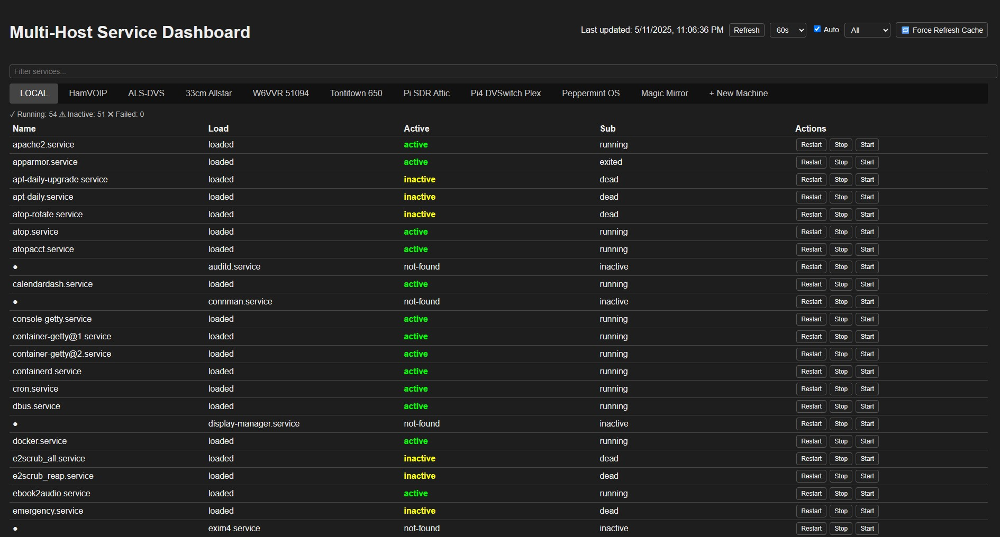

# 🖥️ Services Monitor Dashboard

A self-hosted web dashboard to monitor and control `systemd` services across multiple Linux hosts using SSH.

---

## ✨ Features

- 🔍 View, filter, and sort `systemctl` services
- 🟢 Restart / Stop / Start any service with one click
- 🔁 Auto-refresh with update timestamp
- ➕ Add new machines directly from the web interface
- ✅ SSH key-based login generation from the browser
- 📱 Mobile-friendly UI

---

## 🧠 How It Works

- The dashboard **always includes a built-in `LOCAL` tab** for the host it's running on.
- External systems are defined in `nodes.json`.
- If `nodes.json` is empty or missing, the dashboard still works with `LOCAL` only.
- The **`+ New Machine` tab** allows adding other systems by IP, username, port, and password.
    - It will generate an SSH key and copy it using the provided password (if needed).
    - Your `nodes.json` file is updated automatically.

---

## ⚙️ Installation

### Option 1: Install with Script

```bash
curl -s https://raw.githubusercontent.com/mjwgeek/Services-Monitor-Dashboard/main/install.sh | bash
```
### Option 2: Clone and run manually

```bash
git clone https://github.com/mjwgeek/Services-Monitor-Dashboard.git
cd servicemonitor
chmod +x install.sh
./install.sh
```

👉 Visit your dashboard at `http://YourIpAddress:8484`

## 📸 Preview

Here’s what the Services Monitor Dashboard looks like:


